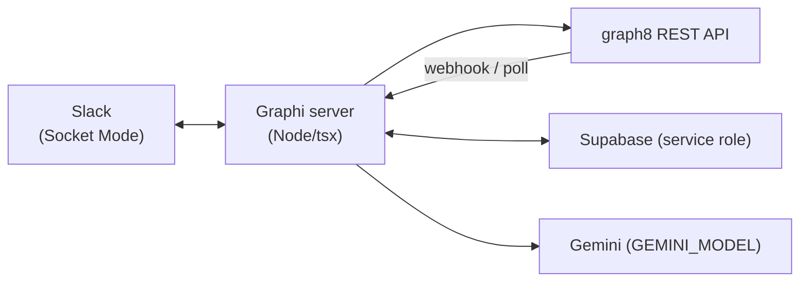

# Graphi

An AI sales team that lives in Slack: five agents — **Ayesha** (Head of Sales), **Bilal** (Scout), **Hira**
(Researcher), **Usman** (SDR), **Zara** (Closer) — that turn one Slack command into real prospecting, research, a
multi-channel outreach sequence, a reply handled within a minute, and a booked meeting + deal, all as real objects in
[graph8](https://be.graph8.com) (CRM, search, enrichment, sequencing, voice, appointments). Thinking is
[Gemini](https://ai.google.dev); state lives in [Supabase](https://supabase.com) (service role).

Built in one day for a graph8 hackathon. See `docs/BUILD-PLAN.md` for the full plan, layer-by-layer fallbacks, and
verify log, and `docs/agents/*.md` for each agent's exact behaviour spec.

## What it does

1. Founder runs `/hire-sales <company-domain>` in Slack.
2. **Ayesha** reads the company's graph8 global-context docs (ICP, persona, brand voice, pricing) and Gemini turns
   them into a plan: target persona, why, channels, budget — posted as an approval card.
3. **Bilal** searches graph8 for real prospects, scores fit, saves the top 10 to a graph8 list/CRM, hands the top 5
   to Hira.
4. **Hira** enriches those 5 in graph8 (verified email/phone), runs research (graph8 AI research + Gemini), and
   writes a "why now" hook for each.
5. **Usman** builds one real multi-channel graph8 sequence (email → LinkedIn → email → voice call → LinkedIn →
   breakup email) from that research and asks the founder to **Launch**. Only allowlisted test contacts are ever
   enrolled; real prospects get a built, previewable sequence and are never contacted.
6. On Launch, graph8 sends the real first email. A reply (or a real inbound call outcome) wakes **Zara**, who stops
   outreach to that account, classifies the reply, books a meeting via graph8 appointments, and creates a graph8
   deal.
7. `/sales-standup` reports the pipeline and per-agent credit spend, pulled live from graph8 and the internal ledger.

## Architecture

```
                         ┌───────────────────────────┐
   Slack (Socket Mode)   │        Graphi server       │        graph8 REST API
  ┌─────────────────┐    │   (Node/tsx, single proc)   │   ┌───────────────────────┐
  │ #sales-team      │◄──┤                             ├──►│ search / CRM / lists   │
  │ #sales-hq        │   │  ┌───────────────────────┐  │   │ enrichment             │
  │ 5 agent personas │──►│  │  bus (typed events)   │  │   │ sequencer + steps      │
  └─────────────────┘    │  └──────────┬────────────┘  │   │ inbox / replies        │
                          │             │               │   │ appointments / voice   │
                          │  ┌──────────▼────────────┐  │   │ intent / intelligence  │
                          │  │ agents: Ayesha, Bilal, │  │   │ webhooks               │
                          │  │ Hira, Usman, Zara      │  │   └───────────────────────┘
                          │  └──────────┬────────────┘  │
                          │             │               │        Gemini (GEMINI_MODEL)
                          │  ┌──────────▼────────────┐  │   ┌───────────────────────┐
                          │  │ inbound: webhook +     │◄─┼──┤ graph8.event webhook   │
                          │  │ poll, cron, scheduler  │  │   └───────────────────────┘
                          │  └──────────┬────────────┘  │
                          └─────────────┼───────────────┘
                                        ▼
                              Supabase (service role)
                          workspaces · agents · leads · tasks
                          reports · approvals · lead_events · credits
```



One process, in-process cron (standup, inbox poll, LinkedIn watcher, step scheduler) — `numInstances: 1` on purpose,
since Slack Socket Mode only tolerates one live connection.

## How graph8 is used — per agent

| Agent | graph8 API areas |
|---|---|
| **Ayesha** (Head of Sales) | `global-context/documents`, `icps`, `personas`, `deals/pipelines`, `mailboxes`, `enrichment/ai/configs`, `intelligence/analyze`, `appointments/event-types`, `usage`, `voice/dialer/numbers`, `workflows/integrations/linkedin/senders` |
| **Bilal** (Scout) | `search/contacts` (people-first prospecting), `lists`, `contacts/assert/batch` (CRM upsert), graph8 intent-signal reads |
| **Hira** (Researcher) | `enrichment/enrich` (waterfall email/phone), `enrichment/verify-email`, `enrichment/jobs/{id}` (job polling), `enrichment/ai/configs` + `enrichment/ai/enrich` (graph8 AI research) |
| **Usman** (SDR) | `sequences` (create), `sequences/{id}` (patch), `sequences/{id}/contacts` (enroll — allowlist-guarded), `sequences/{id}/steps/{step_id}` (patch, e.g. LinkedIn steps added once connected), `voice/dialer/sessions` |
| **Zara** (Closer) | `inbox` / `inbox/{id}` / `inbox/{reply_id}` (read + classify replies), `inbox/{id}/send` (guarded), `inbox/{id}/tag`, `sequences/{id}/contacts/{contact_id}/pause`, `appointments/bookings` (guarded), `deals` (create), `voice/dialer/calls/{room_name}/transcript`, `webhooks` (register) |

All sends (sequence enroll, inbox reply, voice call, booking) route through a shared allowlist guard
(`server/src/contracts.ts` → `G8.enrollGuarded` / `sendReplyGuarded` / `callGuarded` / `bookGuarded`) so only test
contacts in `TEST_ALLOWLIST` can ever be contacted — real prospects can be searched, saved, and enriched, never
messaged.

## Running it

```bash
cp .env.example .env.local   # fill in real values; .env.local is gitignored, never commit it
pnpm install
pnpm -C server typecheck
pnpm -C server start         # or: pnpm -C server dev (watch mode)
```

See `server/README.md` for the full env var reference, scripts, webhook registration, and hot-spare laptop mode.
Hosting: one Render web service (`render.yaml`, repo root) — see `docs/BUILD-PLAN.md` §7 for the deploy flow and
`docs/DEMO-RUNBOOK.md` for the demo-day checklist.

Before making a fork or clone of this repo public, run `bash scripts/secret-scan.sh` — it scans tracked files, full
git history, and any `.env.local` secret values for leaks.
