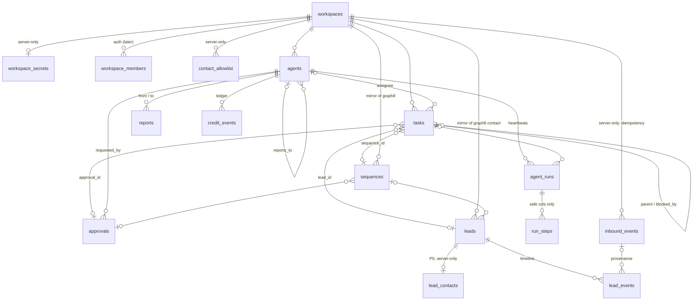

# Supabase schema — AI Sales Team (Slack + Agent Office)

Files: `supabase/migrations/001_init.sql` (schema, RLS, views, realtime, triggers) · `002_portal_run_steps.sql` (activity feed) ·
`supabase/seed.sql` (demo workspace 8x.social + 5 agents + fake data) · `shared/types.ts` (TS contract).
Validated on PGlite (Postgres 18) — migration + seed run twice, RLS checked as `anon`, `types.ts`
column/enum sets diffed against `information_schema`.

## 1. ER overview

Portal-safe (anon/authenticated SELECT when workspace `is_demo` or you are a member):
`workspaces, agents, tasks, agent_runs, reports, approvals, sequences, leads, lead_events, credit_events`
+ views `portal_agents, portal_pipeline, portal_needs_you, portal_today, portal_activity`
+ `run_steps` **safe columns only** (column grants; see §3 decision 15).
Server-only (RLS on, **no policies**, grants revoked): `workspace_secrets, contact_allowlist, lead_contacts,
inbound_events` + `run_steps.args/result/error`. `workspace_members`: a user sees only their own rows.

## 2. Tables

| Table | Purpose | Notes |
|---|---|---|
| `workspaces` | One per client (Slack team + graph8 org). | `is_demo` makes it public to the portal. `timezone`, `standup_hour`, `demo_time_scale`, org-level daily budget, `task_counter` (T-12 numbers), cached `sales_brain`. |
| `workspace_secrets` | Per-client keys: graph8 API key, webhook id/secret, Slack bot token. | Row PK = workspace. Never readable by portal. Slack app-level token is a single env value, not per workspace. |
| `workspace_members` | Supabase Auth users → workspace. | Used by `is_workspace_member()` for RLS later. Empty for the demo. |
| `contact_allowlist` | The **only** humans agents may email/call/DM (team test contacts). | Replaces `TEST_ALLOWLIST` env as source of truth per workspace; seed from env. `tools/g8.ts` guard must check `leads.is_test_contact` **or** a match here. |
| `agents` | Org chart. `reports_to` self-FK; NULL = reports to the founder. | `role` (fixed set), `name` = Slack persona (unique per workspace), `emoji`/`color`/`avatar_url` shared by Slack + portal, `status`, `current_task_id`, daily credit budget + `spent_today_credits` + `spend_day`, optional `model`/`instructions`/`tools` overrides. |
| `tasks` | Unit of work = **one Slack thread**. Parent/child = delegation. | `number` per workspace (trigger), `kind`, `status`, **routable block** (`blocked_on` ∈ founder/approval/task/graph8/connection/budget/lead + `blocked_reason` + `blocked_by_task_id`/`approval_id`, CHECKed), `slack_channel`+`slack_thread_ts` (unique), `input`/`output` jsonb, `result_summary`, checkout lock (`locked_by_run_id`, `locked_at`), `root_task_id` (trigger). |
| `agent_runs` | One row per heartbeat (stateless wake). | `trigger` (slack_message / slack_action / slash_command / cron / webhook / delegation / approval / system / manual) + `trigger_ref`, tokens, `tool_call_count`, `credits_used`, `summary`. |
| `run_steps` | Step log per run (tool/llm/slack/note) = portal activity feed. | `summary` = stored generated column from `result->>'summary'` (PII-redacted by the server). Portal may read `id, run_id, workspace_id, seq, kind, name, summary, ok, credits_used, duration_ms, created_at`; `args`/`result`/`error` stay private (may hold prospect details). |
| `reports` | Messages agents post **up the chain** (also mirrored to Slack). | `from_agent_id` → `to_agent_id` (NULL = founder). `kind`: plan / update / handoff / standup / win / alert / question / answer. `data` jsonb for numbers (standup). Drives the portal report stream. |
| `approvals` | Founder decisions made with Slack buttons. | `kind` + typed `payload` (see `ApprovalPayload` in types.ts), `status` incl. `edit_requested`, `slack_ts` of the button message (unique), `decided_by_slack_user`, `expires_at`. |
| `sequences` | Mirror of the graph8 sequence the SDR built. | `steps` jsonb summary (channel/day/subject) for the approval card + portal; `g8_sequence_id`, `g8_list_id`, `g8_schedule_id`, `lead_count` vs `enrolled_count` (allowlisted subset), `stats`. |
| `leads` | Pipeline mirror of a graph8 contact. **No PII.** | `stage` (funnel), `disqualify_reason`, `fit_score`, `signals` jsonb, `why_now`, `sequence_state`, `last_channel`, `last_reply_intent`, `meeting_at`, `deal_amount`/`deal_stage`, `is_test_contact`, `do_not_contact`, graph8 ids for contact/company/list/deal/meeting. |
| `lead_contacts` | email / phone / linkedin / raw enrichment. | 1:1 with leads, server-only. |
| `lead_events` | Append-only timeline per lead. | `type` (touches, replies, meetings, deals), `channel`, `direction`, human `summary` (no PII), `data`, `inbound_event_id` provenance. Trigger bumps `leads.last_activity_at`/`last_channel`. |
| `inbound_events` | Raw graph8 webhooks / Slack interactions / cron ticks. **Idempotency gate.** | `dedupe_key` UNIQUE. Insert `… on conflict (dedupe_key) do nothing returning id` → process only if a row came back. `status` lifecycle, `attempts`, `run_id`. |
| `credit_events` | Budget ledger: **graph8 credits AND LLM cost**, one unit (`credits`); `source` = graph8/llm/manual; llm rows carry `input_tokens`/`output_tokens` (server converts with `LLM_TOKENS_PER_CREDIT`, default 1000, rounded up). Negative = adjustment. | Trigger keeps `agents.spent_today_credits`, `workspaces.spent_today_credits`, `tasks.credits_used`, `agent_runs.credits_used` in sync, resets on day rollover (workspace timezone), **auto-pauses** the agent at 100 % (`status='paused', pause_reason='budget'`). |

Views (all `security_invoker`, so table RLS applies):
- `portal_agents` — org chart row + budget (already zeroed if `spend_day` is stale) + current task title/thread + done/open counts. The one query the org-chart screen needs.
- `portal_pipeline` — zero-filled count + deal amount per stage per workspace, in funnel order (`ord`).
- `portal_needs_you` — pending approvals ∪ tasks blocked on `founder`/`connection`. "What needs me."
- `portal_today` — one row per workspace: today's numbers in the workspace timezone (credits, agents working/waiting/paused, pending approvals, tasks open/done today, leads found/contacted, replies, meetings, deals, open deal value). The Office "today strip".
- `portal_activity` — `run_steps` safe columns + `agent_id/agent_name/agent_role/agent_emoji/agent_color` + `task_id/task_number/task_title` (via `agent_runs`). The activity feed ("what agents are doing, step by step").

Functions: `app_current_user_id()`, `is_workspace_member(ws)`, `is_workspace_visible(ws)`, `workspace_today(ws)`,
`reset_daily_spend(ws)` (call from the standup cron; resumes budget-paused agents after rollover).

## 3. Key decisions and why

1. **graph8 is the source of truth; we mirror only what the portal and agents need, keyed by graph8 ids (text).**
   Contacts → `leads` (+ private `lead_contacts`), sequences → `sequences` (steps summary), deals/meetings → columns on `leads`
   (`g8_deal_id`, `deal_amount`, `deal_stage`, `g8_meeting_id`, `meeting_at`). No `companies`, `deals`, `meetings` tables today:
   one deal/meeting per lead is enough for the demo; `company_domain` on leads groups the account ("pause whole account on reply").
2. **PII split by table, not by column grants.** `leads` has name/title/company only; email/phone/LinkedIn live in `lead_contacts`
   with no portal policy. This works with Realtime (which streams table rows, not views) and cannot leak via `select *`.
   Rule for everyone: `lead_events.summary`, `reports.body`, `tasks.result_summary` must never contain an email/phone.
3. **Fixed role set (`head_of_sales, scout, researcher, sdr, closer`) with per-workspace agent instances.** Adding a role
   = one ALTER on `agents_role_chk` + a brain in the server. Personas (name/emoji/color) are per workspace so clients can rename.
   Org chart = `reports_to` self-FK (Paperclip pattern). Unique `(workspace_id, name)` so Slack routing by name is unambiguous;
   two SDRs later is fine (`role` is not unique).
4. **Task = Slack thread; delegation = child task.** Head creates a child for a sub-agent, sets its own task
   `blocked_on='task'`, and is woken when the child hits `done`. Every `blocked` task must name its owner (CHECK), so
   the portal can always say who is waited on. `root_task_id` lets the portal show the whole tree from `/hire-sales`.
5. **Stateless heartbeats logged in `agent_runs`; checkout lock on tasks.** `locked_by_run_id` + `locked_at`
   (Paperclip "never retry a 409"): `update tasks set locked_by_run_id=$run where id=$id and (locked_by_run_id is null or locked_at < now()-interval '10 min') returning *`.
6. **Idempotency in one place: `inbound_events.dedupe_key`.** graph8 retries carry a *new* `X-Studio-Delivery-Id`, so the key
   is `sha256(event|timestamp|json(data))`; Slack = `event_id` or `${action_id}:${message_ts}:${user}`; cron = `${job}:${date}`.
   Slack button double-clicks are additionally guarded by `update approvals … where status='pending' returning id`.
7. **Budgets: ledger + cached counters + daily reset in workspace timezone.** Ledger is truth; counters exist for cheap
   realtime display. Reset is lazy (trigger on next spend) and explicit (`reset_daily_spend` from the 09:00 cron).
   Hard stop at 100 % auto-pauses the agent; 80 % warn threshold (`budget_warn_pct`) is read by the server (no spam table yet).
   **Both graph8 credits and LLM cost count** (founder decision); the ledger's `source` keeps them distinguishable for reports.
   Demo limits are deliberately huge (100,000/agent/day, 500,000/workspace) so the mechanism exists but never interferes on stage.
8. **Approvals are typed objects** (`kind` + `payload`), rendered per kind in Block Kit; `edit_requested` keeps the founder's
   note so the agent can revise. `slack_ts` stored to update the message in place after the decision.
9. **text + CHECK, not enums.** Named constraints (`tasks_status_chk`) so extending is one `alter table … drop/add constraint`.
   `shared/types.ts` carries matching `*_VALUES` arrays; the validation script diffs them against `pg_constraint`.
10. **No soft delete.** Lifecycle via status columns (`cancelled`, `disqualified`, `do_not_contact`, `archived`).
    Cascades only from `workspaces` (scripts/reset-demo deletes the workspace row and reseeds).
11. **RLS now vs later, same policies.** `is_workspace_visible(ws)` = `workspaces.is_demo OR member`. Demo: `is_demo=true`,
    anon key reads. Production: set `is_demo=false`, add `workspace_members` rows, portal uses Supabase Auth — no policy changes.
    Portal never writes (no insert/update policies); all writes go through the server with the service key.
12. **Realtime** on `workspaces, agents, tasks, reports, approvals, sequences, leads, lead_events` (replica identity full) + `run_steps` (inserts only, default replica identity).
    Not on runs/credits (noisy); portal derives spend from `agents` updates. Realtime honours RLS, so private tables never stream.
13. **Allowlist in the DB** (`contact_allowlist`) rather than only env: per-workspace, auditable, and the guard has one query.
    `leads.is_test_contact` is the denormalized flag set when a lead matches the allowlist.
14. **Slack references are plain text ids** (`C…`, `U…`, `ts`), never FKs to a Slack mirror table. Unique index on
    `(workspace_id, slack_channel, slack_thread_ts)` gives O(1) thread → task lookup.
15. **run_steps exposed by RLS + column grants, not a separate table** (migration 002). Realtime streams table rows, never
    views, so a view alone cannot power a live feed. `run_steps` gets an anon/authenticated `portal_read` policy
    (`is_workspace_visible`) and `GRANT SELECT (safe columns)` only; `args/result/error` are not granted, so `select *` or
    `select=args` as anon fails with `42501 permission denied`, and Realtime (which checks the subscriber's RLS and column
    privileges) does not deliver them either. `summary` is a generated column so the portal never needs `result`.
    Portal reads `portal_activity` (security_invoker → same RLS + grants) and uses realtime INSERTs as a refetch signal.

## 4. How the server should use it (cheat sheet)

- **Webhook**: verify HMAC → `insert into inbound_events … on conflict do nothing returning id` → if row: resolve workspace by
  `payload.org_id` → find lead by `(workspace_id, g8_contact_id)` → insert `lead_events` (+ update `leads.stage`) → create/wake
  task for Zara (`agent_runs.trigger='webhook', trigger_ref=inbound_event.id`) → mark `processed`.
- **Slack action** (Approve/Edit/Skip): dedupe via `inbound_events` → `update approvals set status=… where id=$1 and status='pending' returning *`
  → if row: update the blocked task (`status='todo'` or `'cancelled'`) → wake the requesting agent (`trigger='approval'`).
- **Delegation**: insert child task (`parent_task_id`, `assignee_agent_id`), post the parent message in `#sales-team`, store
  `slack_thread_ts`, set parent `blocked_on='task', blocked_by_task_id=child`. When the child finishes, insert a `handoff` report
  and wake the parent's assignee (`trigger='delegation'`).
- **Any graph8 call that costs credits**: insert `credit_events` (agent, task, run, action, credits). Check
  `agents.status <> 'paused'` before starting a run; the trigger pauses automatically at the cap.
- **Standup cron**: `select reset_daily_spend(ws)`; read `portal_pipeline`, `portal_agents`, yesterday's `lead_events`; insert
  `reports(kind='standup', data=StandupData)`.
- **Send guard** (`tools/g8.ts`): refuse unless `leads.is_test_contact` or the target email/phone/linkedin matches
  `contact_allowlist` for that workspace, and `leads.do_not_contact = false`.
- **Closer auto-send**: when `last_reply_intent = 'interested'` the Closer sends the reply (slots) without an approval —
  guard above still applies. Other intents (question/objection/…) create `approvals.kind='send_reply'`. Waiting for the
  prospect to answer = task `blocked_on='lead'`.
- **LLM cost**: after each run insert `credit_events(source='llm', action='llm_run', credits=ceil(tokens/LLM_TOKENS_PER_CREDIT), input_tokens, output_tokens)`.

## 5. Deferred to "later" (designed for, not built)

- `companies` / `deals` / `meetings` tables (multi-deal per lead, account-level rollups).
- `budget_incidents` (dedupe 80 % / 100 % alerts), monthly budgets, per-workspace plan/billing.
- `activity_log` generic audit of every mutation (today: `agent_runs` + `run_steps` + `lead_events` + `credit_events`).
- Slack installation table (multi-team OAuth install; today tokens live in `workspace_secrets`).
- Column-level encryption of `workspace_secrets` (Supabase Vault) — today protected by RLS + revoked grants only.
- Partitioning / retention for `run_steps`, `inbound_events`.
- Extensible roles table (`agent_roles`) if clients define custom agents.
- Realtime broadcast channel instead of `postgres_changes` if the portal fans out to many viewers.

## 6. Decisions log (founder, 2026-09-27 04:39 PKT)

1. Agent names Ayesha / Bilal / Hira / Usman / Zara — approved.
2. Budget window stays **daily**; limits huge for the demo (100,000/agent, 500,000/workspace); auto-pause kept.
3. Real prospects' names/companies visible on the public demo portal — accepted.
4. Closer **auto-sends** when reply intent is `interested`; allowlist guard still gates every send. `send_reply` approvals remain for other intents.
5. Stage `queued` kept.
6. Budget counts **graph8 credits + LLM cost**; ledger `source` distinguishes them; llm rows carry tokens.
7. Slack app-level token = single env value; column dropped from `workspace_secrets`.
8. Server clears `agents.status='waiting_on_you'` when an approval is decided.

## 7. Still open

1. graph8 app record URLs (contact / deal / sequence / meeting) — list pages verified (`docs/graph8-app-links.md`), record patterns not (org had no rows). Portal links fall back to list pages until verified.
2. Should the portal see `agent_runs` (tokens, tool counts)? Currently yes (summary only); flip to private by dropping its policy.
